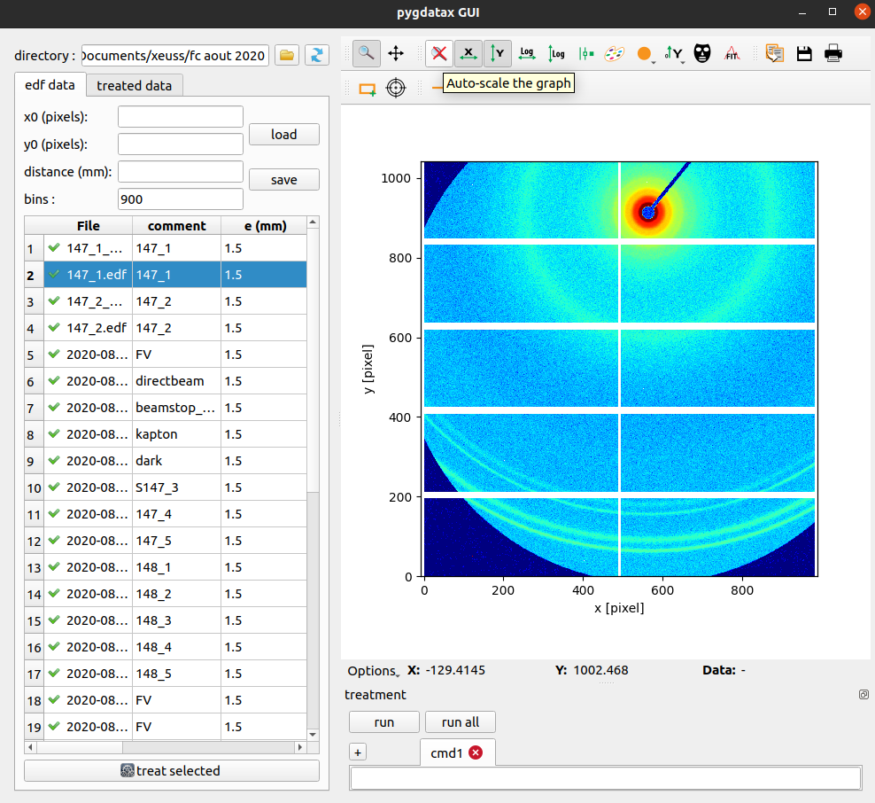

# PYGDATAX
Python libray for Small Angle Neutron (SANS) and X-ray (SAXS) data treatment and visualization.
This package can be used for the following instruments : 
 - Xeuss 2.0 SAXS instrument
 - SANS_LLB instrument installed at the Paul Scherrer Institut (PSI)
## Installation
To install pygdatax, run:
```
pip install pygdatax
```
Depending on your OS and python distribution, you may need to install PyQt5 and Ipython
```
pip install pyqt5 Ipython
```
## Upgrade Version
pygdatax package is up to now often upgraded. In order to get the last version type the following command in your
 terminal or acaconda prompt
```
pip install --upgrade pygdatax
```
## Launch Graphical User Interface for Xeuss data treatment and visualization
To launch the GUI, run in you terminal (or conda prompt):
````
pygdatax_gui
````



## Quick Overview

### EDF viewer
